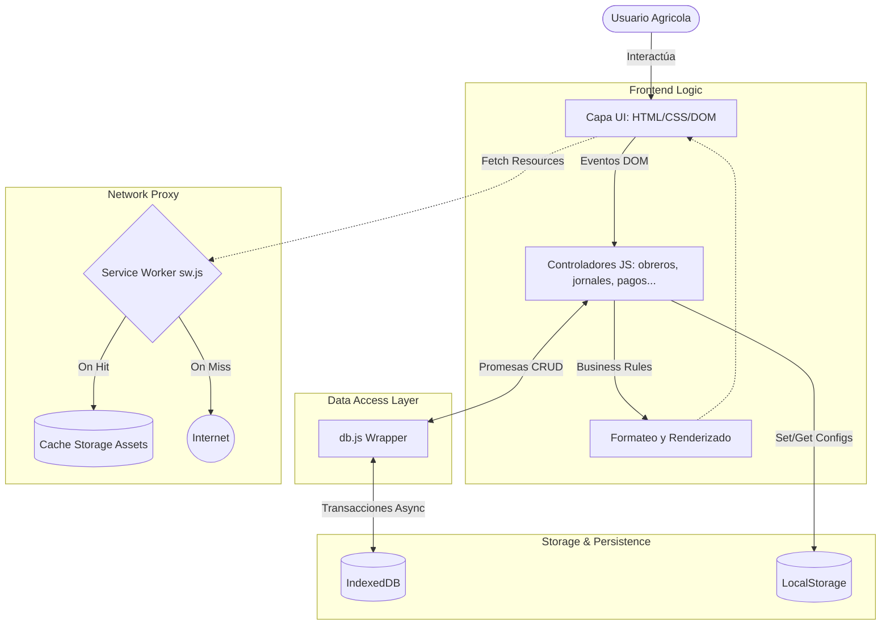
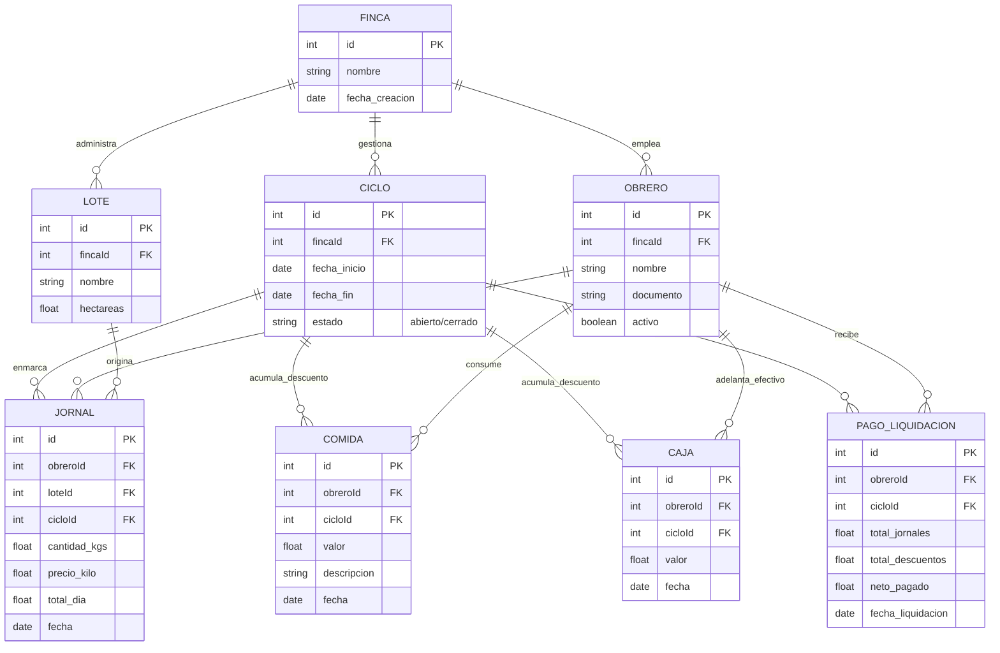
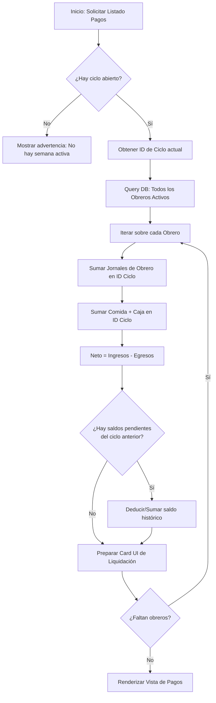
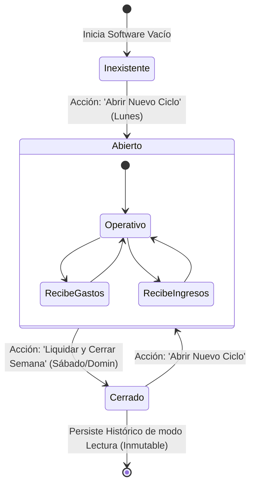
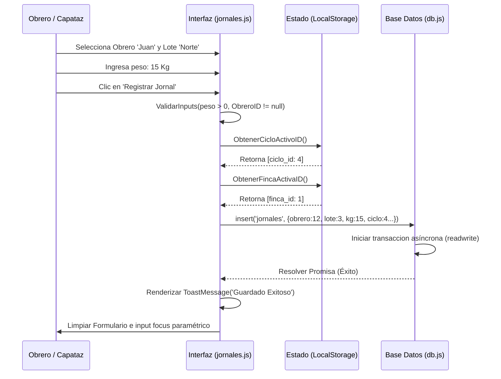

# Documentación Técnica de Software: CaféControl

> **Rol:** Arquitecto de Software Senior
> **Versión del Documento:** 2.0.0
> **Tipo de Sistema:** Progressive Web App (PWA) Offline-First
> **Dominio:** Plataforma para la Gestión Integral de Fincas Cafeteras

---

## 1. Introducción del Proyecto

### Descripción general
**CaféControl** es una plataforma de gestión integral diseñada específicamente para la administración operativa y financiera de fincas cafeteras. Desarrollada como una Aplicación Web Progresiva (PWA), la solución está orientada a operar sin interrupciones en entornos rurales donde la conectividad a internet es intermitente o nula, garantizando la captura y procesamiento de datos críticos directamente en el campo.

### Problema que resuelve
Históricamente, el sector agrícola caficultor ha dependido de sistemas de registro manuales en papel. Esta práctica conlleva una alta tasa de error humano en cálculos de nómina, pérdida de información por deterioro físico, dificultad para consolidar datos financieros y una nula trazabilidad del rendimiento productivo a nivel de lotes y trabajadores. La falta de cobertura de red en las zonas de cultivo imposibilita la adopción de soluciones SaaS tradicionales basadas en la nube.

### Objetivos del sistema
- **Digitalización Total:** Migrar el registro operativo (pesajes, asistencias, adelantos) y financiero (liquidaciones) a un entorno digital unificado.
- **Resiliencia Operativa:** Garantizar un funcionamiento 100% offline mediante el almacenamiento local de datos y recursos.
- **Automatización Financiera:** Calcular de manera automática, precisa y transparente la liquidación semanal de los trabajadores, deduciendo consumos y anticipos.
- **Trazabilidad y Análisis:** Proveer métricas claras sobre la producción de café por lote, eficiencia de los recolectores y control de inventarios.

### Público objetivo
- **Propietarios y Administradores:** Usuarios orientados al análisis de reportes, visualización de dashboards y toma de decisiones estratégicas.
- **Mayordomos (Capataces):** Usuarios operativos en campo encargados de registrar asistencia, pesajes diarios y entregas de herramientas/comida.

---

## 2. Descripción General del Sistema

### Qué es CaféControl
CaféControl es una solución tecnológica descentralizada que transforma un dispositivo móvil o de escritorio estándar en un terminal de gestión agrícola autónomo. Al prescindir de un servidor o base de datos centralizada durante su operación rutinaria, el sistema ofrece la inmediatez de una aplicación nativa.

### Cómo funciona a nivel conceptual
El núcleo del sistema es un motor de base de datos embebido en el navegador (IndexedDB) acoplado a un esquema de control de versiones de recursos web (Service Workers). El flujo se organiza alrededor de unidades de tiempo denominadas **Ciclos**. Un ciclo (generalmente una semana) agrupa toda la actividad económica y productiva. Al finalizar el periodo estipulado, el sistema ejecuta un cruce contable de ingresos ("jornales" y bonificaciones) contra egresos ("comida" y "caja") por cada obrero, generando una pre-liquidación y permitiendo el cierre inmutable de los datos de esa semana.

### Beneficios del sistema en el contexto agrícola
- **Disponibilidad Continua:** La recolección de datos no se detiene si se corta la conexión a celular/internet.
- **Reducción de Deuda Técnica Administrativa:** Simplifica el cierre de nómina de fin de semana, pasando de horas de tabulación manual a minutos de validación.
- **Transparencia Laboral:** La generación de comprobantes detallados mejora la relación de confianza con los recolectores, al justificar matemática y temporalmente cada descuento.

---

## 3. Arquitectura del Sistema

### Tipo de arquitectura
El proyecto implementa una arquitectura **Client-Side** bajo el paradigma **Offline-First PWA (Progressive Web Application)**. Al carecer de un Backend activo para las operaciones transaccionales, toda la capa lógica y de persistencia se resuelve en el dispositivo del cliente.

### Arquitectura en capas
1. **Capa de Presentación (UI/View):** Componentes del DOM gestionados dinámicamente mediante Vanilla JavaScript inyectando HTML/CSS.
2. **Capa Lógica (Controladores):** Módulos JS que procesan reglas de negocio, validaciones y cálculos antes de invocar a la base de datos.
3. **Capa de Acceso a Datos (DAL):** Una abstracción o envoltorio (`db.js`) sobre transacciones nativas asíncronas para estandarizar el CRUD.
4. **Capa de Persistencia (Storage):** IndexedDB para datos estructurados y relacionales; LocalStorage para configuraciones de sesión e identificadores simples.
5. **Capa de Red/Caché (Service Worker):** Proxy de red cliente que sirve de middleware entre la UI y la red exterior, garantizando que todos los recursos HTML/JS/CSS y Assets se sirvan desde caché en ausencia de conexión.

### Flujo de datos del sistema
Los *Event Listeners* de la UI capturan intenciones de usuario y las envían a los controladores modulares. El controlador ensambla el objeto semántico requerido y solicita una transacción de escritura. La capa DAL orquesta una transacción en IndexedDB; si ocurre un problema, se cancela vía *Rollback* automático. Si es exitosa, se despacha una actualización a la UI para renderizar el nuevo estado.

---

## 4. Diagrama de Arquitectura



---

## 5. Estructura del Proyecto

La estructura de directorios sigue convenciones de separación de responsabilidades (*Separation of Concerns*), segregando lógica de negocio por dominios (módulos).

```text
/CafeControl
│
├── index.html            # Punto de entrada único (Single Page Application implícita)
├── manifest.json         # Metadatos PWA (iconos, tema, orientación) para instalación
├── sw.js                 # Service Worker: Lógica de caché y estrategia Offline
│
├── css/
│   └── index.css         # Hoja de estilos principal (Variables, Diseño global)
│
├── js/
│   ├── app.js            # Bootstrapper: Inicia lógica, gestiona Fincas y UI global
│   ├── config.js         # Configuraciones de preferencias y Backup (Exportaciones)
│   ├── db.js             # Gestor de base de datos local y promesas IndexedDB
│   ├── ciclos.js         # Lógica de cierre y apertura de semanas de trabajo
│   ├── obreros.js        # CRUD y estado de empleados/recolectores
│   ├── lotes.js          # CRUD de ubicaciones geográficas de recolección
│   ├── jornales.js       # Registro de kilos y rendimiento diario por empleado
│   ├── comida.js         # Controlador de débito por insumos o víveres
│   ├── caja.js           # Controlador de débito por adelantos en efectivo
│   ├── pagos.js          # Motor de liquidación aritmética semanal
│   ├── asistencia.js     # Matriz de presentismo diario
│   ├── dashboard.js      # Métricas y KPIs de visualización (Widgets)
│   └── reportes.js       # Consultas consolidadas históricas
│
└── icons/                # Activos gráficos para PWA y UI (Favicons, logos)
```

**Propósito de archivos clave:**
- **`sw.js`**: Implementa estrategias de caché agresivas (ej. *Cache First* o *Stale-While-Revalidate*) para que la app cargue instantáneamente incluso en modo avión.
- **`db.js`**: Aísla la complejidad de la API nativa de IndexedDB (solicitudes, transacciones, cursores, actualizaciones de meta-versión) en funciones asíncronas reusables (`getAll`, `put`, `deleteByObjectStore`).

---

## 6. Módulos del Sistema

### Gestión de fincas
- **Propósito:** Proveer un entorno multi-tenant o multi-organización local, donde una misma aplicación puede cambiar de contexto operativo sin mezclar datos.
- **Flujo:** Creación de perfil, asociación del "Finca Activa" en LocalStorage, recarga de la aplicación aislando las consultas a la ID de finca.
- **Datos:** Identificadores, nombres, área.

### Gestión de ciclos
- **Propósito:** Demarcar temporalmente las operaciones. Actúa como libro contable. Un periodo "abierto" recibe transacciones; uno "cerrado" es inmutable de solo-lectura.
- **Flujo:** Creación del ciclo con fecha de inicio y configuración de fin de semana esperado. Validación global (ningún otro módulo puede escribir si no hay ciclo activo). Cierre del ciclo una vez se pagan las nóminas.
- **Datos:** ID, estado (abierto/cerrado), fechaInicio, fechaFin.

### Gestión de trabajadores
- **Propósito:** Mantener la base de datos de capital humano.
- **Flujo:** Alta de trabajador con DNI y nombre. Asignación de rol. Visualización de historial de deudas acumuladas de la anterior quincena a la actual. Baja lógica (soft delete).
- **Datos:** ID empleado, nombre, documento, estado activo, saldos arrastrados.

### Gestión de lotes
- **Propósito:** Segmentar geográficamente la producción para controlar eficiencia del terreno (kilogramos recolectados / hectárea).
- **Flujo:** Registro topológico (Nombre Lote, Variedad, Área). Todos los registros de ingresos deben asociarse al lote que se está cosechando ese día.
- **Datos:** ID lote, nombre, tamaño.

### Registro de asistencia
- **Propósito:** Pre-requisito laboral. Contabilizar los días efectivamente laborados (útil en casos de pago por jornada fija en lugar de destajo).
- **Flujo:** Apertura diaria del listado de personal. Marcación de checks (Presente/Ausente). Actualización dinámica sobre el ciclo activo.
- **Datos:** fecha_dia, listado_ausentes_ids, cicloId.

### Registro de jornales
- **Propósito:** Captura del rendimiento a destajo (kilos de café recolectados y pesados en tolva/báscula).
- **Flujo:** El operario selecciona Lote -> Obrero -> Digita los Kilos -> Envía. El sistema multiplica kilos por la tarifa vigente para determinar el crédito bruto del trabajador ese día.
- **Datos:** ID empleado, ID lote, ID Ciclo, peso(Kg), valor_calculado, fecha_transaccion.

### Registro de comida y caja
- **Propósito:** Registrar débitos a la cuenta del empleado para deducirlos de la liquidación semanal.
- **Flujo:** Búsqueda rápida del obrero (ej. llegó a la tienda de la finca), digitación de monto, anotación descriptiva ("herramienta, jabón, víveres", o retiro "x efectivo"). Confirmación inmediata afectando el débito de su ciclo activo.
- **Datos:** ID empleado, monto_descuento, concepto/nota, tipo (Caja vs Comida), fecha_transaccion.

### Liquidación de pagos
- **Propósito:** Generar el balance final de la semana, conciliando la relación ingreso/egreso.
- **Flujo:** Recorrido transaccional por todas las tablas. Sumatoria Grupal por ID Empleado: `Total Kilos * $ -> Ingreso Bruto` Memos `Sumatoria Caja + Comida`. El sistema advierte sobre saldos negativos y genera liquidación bloqueada (read-only) de tipo "Pagado".
- **Datos:** consolidado_semanal por obrero_id, netos_a_pagar, saldos_pendientes.

### Reportes y dashboard
- **Propósito:** Analítica de datos.
- **Flujo:** Consulta masiva en modo lectura de registros cerrados. Se agrupan bajo librerías de interfaz para mostrar en gráficas la volatilidad del precio del kilo o el volumen de café proyectado.
- **Datos:** KPIs agregados (Suma total kilos semana, total pagado en nómina, deudas activas flotantes).

---

## 7. Modelo de Datos (Esquema ERD)

El modelo de almacenamiento lógico implementado sobre la estructura *Object Store* de IndexedDB se resume conceptualmente aquí:



### Explicación Relacional Principal
- Toda transacción (Jornal, Comida, Caja) es estrictamente dependiente de una clave foránea doble: Debe adjudicarse a un empleado y debe insertarse dentro del marco de tiempo delimitado por el `cicloId`. Sin este identificador concurrente, la integridad referencial se rompe y es imposible liquidar.

---

## 8. Flujo de Trabajo del Usuario

El ciclo de la vida operativa en torno al sistema:

1. **Crear finca:** El administrador inicia la aplicación PWA y configura una "Nueva Finca", generando el entorno macro de trabajo.
2. **Registrar trabajadores:** Se crea la lista base de personal (los nombres y roles como "Recolector").
3. **Crear lotes:** Se definen los sectores sembrados a trabajar en temporada.
4. **Abrir ciclo semanal:** Usualmente cada Lunes, se inicia un Ciclo y su estado pasa a "Abierto".
5. **Registrar asistencia:** Todas las mañanas el capataz pasa lista usando el módulo de asistencias.
6. **Registrar jornales:** En horas de la tarde, cada canasta/saco llenada de café por trabajador se pesa y se ingresa la cifra en kilogramos en "Jornales".
7. **Registrar consumos:** Durante cualquier hora, si alguien solicita jabón en tienda o requiere su pasaje de transporte, se carga en "Comida" o "Caja".
8. **Generar liquidación:** El domingo o sábado por la tarde, en el módulo "Pagos", el sistema cruza las sumatorias de ingresos (Jornales) contra las retenciones acumuladas.
9. **Cerrar ciclo:** Con las liquidaciones listas y pagadas físicamente, el ciclo se "Cierra", bloqueando modificaciones retroactivas y propiciando un entorno limpio para un nuevo paso 4.

---

## 9. Diagramas UML

### Diagrama de Flujo del Proceso: Generación de Planilla



### Diagrama de Estados del Ciclo



### Diagrama de Secuencia: Registro de un Jornal



---

## 10. Seguridad y Control de Datos

Aún operando bajo el paradigma Offline, el sistema aplica rigurosas validaciones para asegurar integridad.

- **Validaciones de datos:** La santificación de entradas (sanitization) restringe caracteres no numéricos en inputs monetarios. Se previene inserción de datos espurios verificando la existencia previa del `cicloId` usando controles lógicos cruzados en los controladores.
- **Control de duplicados:** Identificadores autoincrementables (Keys) manejados automáticamente por el motor subyacente de IndexedDB evitan la sobreescritura errónea.
- **Manejo de errores:** Todo interactuador con `db.js` está envuelto en estructuras de control `try/catch`. Si una excepción a nivel de Promise de IndexedDB falla, el catch notifica al usuario sin bloquear la consola y revierte la transacción.
- **Riesgos de pérdida de datos:** Siendo una base de datos de navegador (Web Storage APIs), existe el riesgo de que las políticas agresivas de liberación de OS (como iOS Safari / Edge) borren los datos ante falta de espacio de disco, o que el usuario desinstale la app.
- **Estrategia de backups:** Para contrarrestar la limitación de la volatilidad, un módulo implementa serializadores de la base de datos completa. Un botón permite **Exportar Base de Datos** como archivo `.json` de respaldo en el dispositivo. Si el navegador revoca almacenamiento, el usuario puede importar este JSON y recuperarse íntegramente.

---

## 11. Buenas Prácticas de Ingeniería Aplicadas

- **Separación de responsabilidades (SoC):** Cada archivo en la carpeta JS (ej. `obreros.js` vs `jornales.js`) se encarga exclusivamente de resolver las métricas y eventos vinculados a su dominio. 
- **Arquitectura Modular basada en Fichas (Componentes sin frameworks):** Aunque utiliza Vanilla JS puro, el patrón estructural imita componentes. Un archivo escucha, mapea datos, llama al servicio (API base), y re-renderiza un fragmento del árbol DOM.
- **Uso Estándar de Promesas (Async/Await) en IDB:** IndexedDB funciona internamente con un viejo API de `onreq.success = callback`. El sistema inyecta un envoltorio en `db.js` que transforma estas llamadas asíncronas antiguas en flujos de control legibles `await store.get(id)`, evitando fuertemente el fenómeno del *Callback Hell*.
- **Manejo de Estados Confiables:** Se hace constante un origen de verdad (*Single Source of Truth*). La UI no guarda los datos del ciclo, los solicita. Si cambia una pestaña, confía en el local storage u operacionales centralizados para reflejar cambios en lotes.
- **Optimización para Dispositivos Móviles:** Uso de inputs type `number` y `tel`, carga perezosa de vistas secundarias, tamaño mínimo del paquete (minificación futura en pipeline) y paleta oscura pensada para ahorrar batería y deslumbrar menos bajo el sol.

---

## 12. Mejoras Futuras y Roadmap Técnico

1. **Sincronización en la Nube (Cloud Sync):** Implementación de una arquitectura Local-First. Mantener SQLite o IndexedDB en cliente y usar una cola de mensajes en Service Worker para despachar un Push asíncrono hacia un backend central (REST API/GraphQL) cuando el dispositivo recupere la conexión de red celular.
2. **Autenticación y Sistema Multiusuario:** Permitir roles RBAC y autenticación (OAuth o Simple JWT). Previene la mutación indebida de ciclos mediante tokens autorizantes (el Mayordomo reporta, el Administrador cierra ciclos).
3. **Integración con Hardware Físico o QR:** 
   - Uso de la API *WebRTC Media Devices* orientada a escanear código QR de la tarjeta cada de obrero, para un pesaje automatizado sin demoras de tipografía.
   - Conexión vía *Bluetooth Web API* directo contra básculas industriales para captar un peso automático al gramo sin sesgos humanos.
4. **Analítica Avanzada:** Inserción de la librería de graficado ligera (ej. eCharts/Chart.js) exportando métricas agrónomas estandarizadas como eficiencia de Recarga de Ciclos o Kilogramos / Hectárea Semanal, calculando estacionalidad predictiva en navegador.
5. **Optimización de Rendimiento Frontend:** Trasladar rutinas computacionales muy intensivas (como el cálculo retroactivo de liquidaciones en bases de datos con cientos de miles de registros) hacia una capa de **Web Workers**, evitando congelar el *Event Loop* de la UI e incrementar la percepción de velocidad.

---

## 13. Conclusión Técnica del Proyecto

En conclusión, **CaféControl** representa una integración exitosa de tecnologías modernas enfocadas a un nicho industrial con exigentes restricciones de conectividad. Como Arquitectura PWA Client-Side con bases de datos transaccionales asíncronas embebidas en el explorador, elimina la latencia de red y entrega la inmersividad de aplicaciones nativas pesadas en un footprint nulo (descarga en backgrounds instantánea).

Desde la perspectiva de la Ingeniería de Software, desacoplar el DOM de la manipulación de base vía `db.js` e interceptar activos con estrategias refinadas de Service Worker, eleva un código puramente local al nivel de soluciones de grado empresarial (Enterprise Application Grade). El principal valor radica en la reducción total de dependencia del Internet, la agilización crítica del cuello de botella financiero (cierre semanal de los jornales) y el establecimiento del esqueleto técnico idóneo –completamente documentado y modular– para soportar sincronización *Cloud* inminente en versiones futuras.
